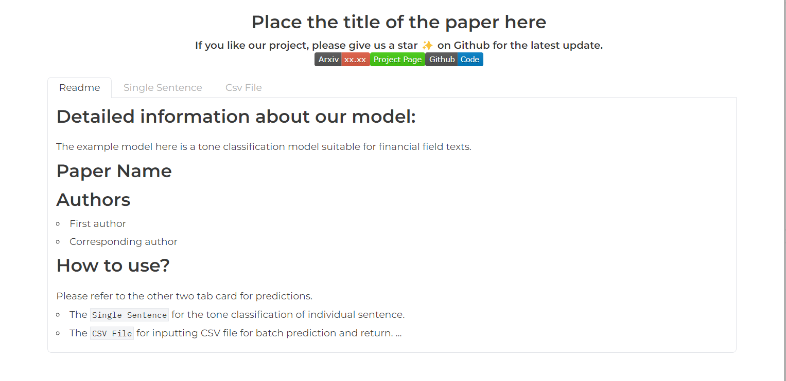
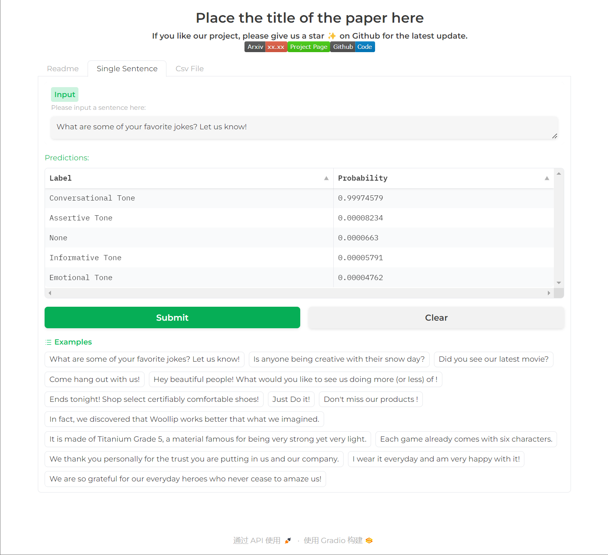
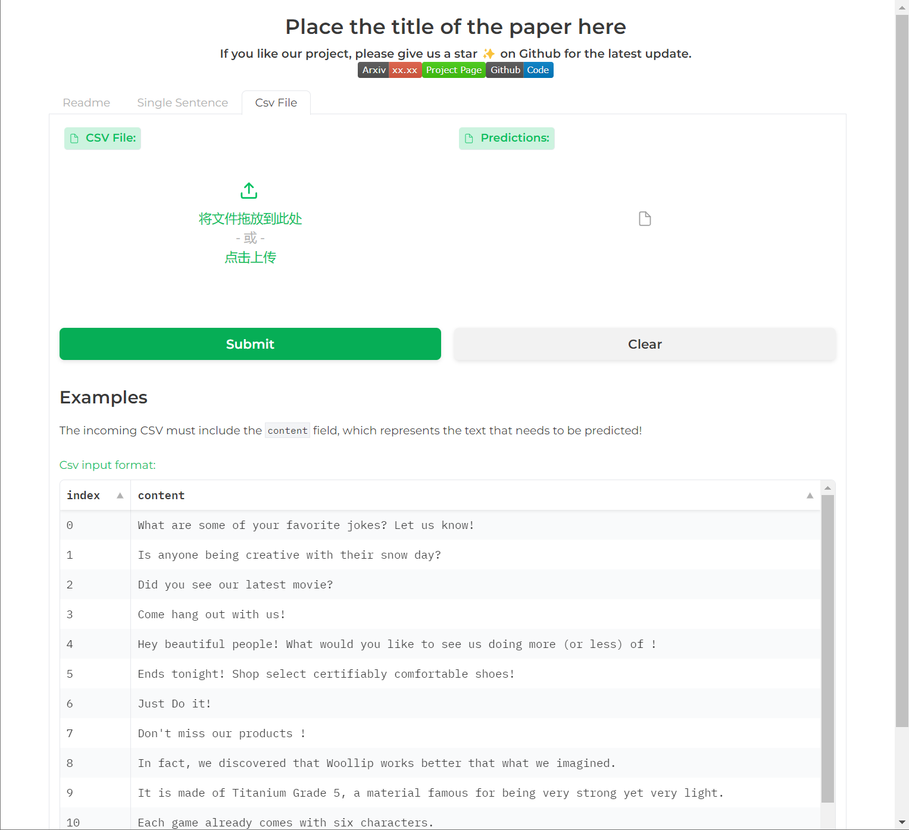
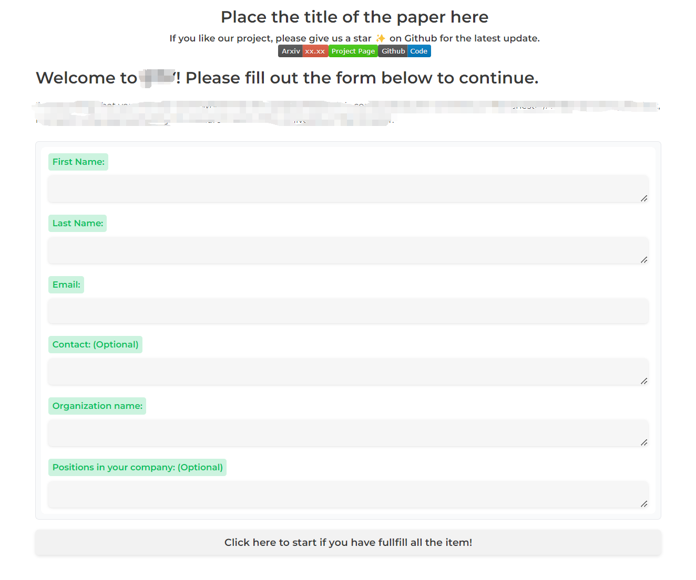

# Gradio for classification
This is a minimalist gradio page template designed for displaying classification tasks. 

You can click on the link below to view it on [huggingface space](https://huggingface.co/spaces/cheesexuebao/murphy)🤗.


# 简介

Gradio是一款轻量级的机器学习模型展示工具。使用者仅需几行代码，便可轻松构建简单的模型展示页面。然而，要使页面更美观、功能更丰富，则需要开发者投入一定的时间和精力。本仓库提供了一个用于分类任务的Gradio模板，支持单一和批量输入，旨在为大家提供参考。

本仓库以金融领域的语气分类模型为例，该模型的输入为文本，输出为五个预设类别的概率：

```python
# Use a pipeline as a high-level helper
from transformers import pipeline

pipe = pipeline("text-classification", model="Oliver12315/Brand_Tone_of_Voice")
```

## 详细信息页面



该页面用于展示项目详细信息，可以通过修改内部代码或者README文档的形式修改具体内容。

在页面标题下方，可以通过修改`app.py`内部的HTML代码块，添加诸如arxiv、github链接等。

## 单例预测



用户输入单句文本或者点击`Examples`中的示例后，提交并获得不同类别的输出概率。

## 批量预测



用户可以提交符合规范示例中规范的Csv数据，模型会批量预测并返回Csv预测结果供下载。

# 附加功能

除了上述的简单功能之外，我们还新增了一个信息收集页面。

**考虑到Gradio并不提供页面跳转功能，我们设计了一种分页的解决方案。**

举例来说，用户必须在填写完信息后才能进入后续页面。这种设计在Hugging Face Space的部署中非常有效。如果需要，欢迎联系我们。



# 联系方式

邮箱：yyxx20150909@163.com

知乎：https://www.zhihu.com/people/mofeishiyizhimiao